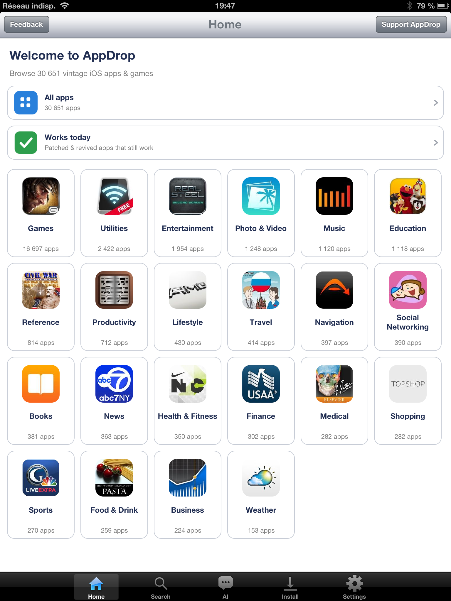
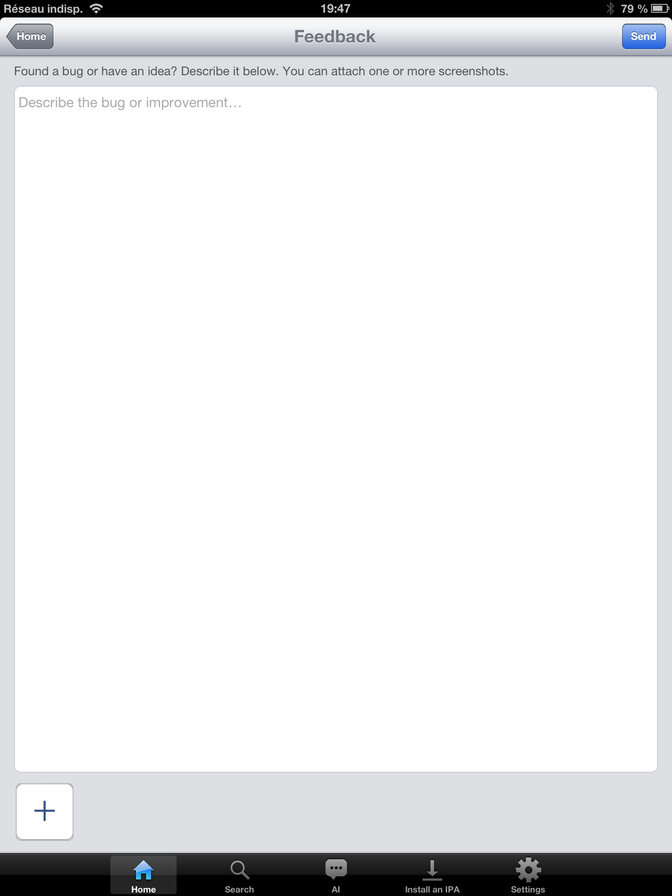

# AppDrop

> Browse 157,000 archived iOS apps from 2008–2014 and install them on your jailbroken device, with built-in AI search.

<p align="center">
  
</p>

<p align="center">
  <a href="https://paypal.me/adrienrl1"><b>💖 Like AppDrop? Tip the dev on PayPal</b></a>
</p>

<p align="center">
  
</p>

---

## Compatibility

- **iOS 5.0 – 10.x** (armv7 / 32-bit) — fully supported and tested on iPad 1 (iOS 5.1.1), iPhone 5 (iOS 6.1.4), iPad 4 (iOS 6.1.3), iPad mini 2 (iOS 10.3.3).
- **iOS 11+** — not supported. The binary is 32-bit only and Apple dropped 32-bit app support in iOS 11.
- Compatible devices: iPad 1, iPhone 3GS / 4 / 4S, iPad 2 / 3 / 4 / iPad mini, iPod touch 3 / 4 / 5 (and 64-bit devices like iPad Air / iPhone 5S running iOS 10.3.3 or lower).
- Requires a **jailbreak** — that's it. Cydia handles the rest.

## Features

- **Huge vintage catalog** — tens of thousands of unique apps (157k archived IPAs across all versions), browsable **by category** right from the home screen
- **Auto-updating catalog** — downloaded on first launch and refreshed automatically when new apps are added, so you never reinstall the app just for new content
- **"Works today"** — a curated list of apps confirmed still running on old iOS, with one-tap install and update detection
- **AI search** — describe an app in any language, the LLM finds it for you
- **Device-aware** — each app shows whether it'll run on *your* device, the catalog hides apps your iOS can't run, and AppDrop auto-picks the newest version you can actually install
- **8 languages** — EN / FR / ES / DE / PT‑BR / JA / ZH‑Hans / TR, auto-detected from your device
- **Localized app descriptions** — rich descriptions for thousands of apps, in all 8 languages
- **Multi-select install** — queue up dozens of apps in one batch, with a configurable max of simultaneous downloads (1–8)
- **Cancellable downloads** — live progress, a "N downloading · M waiting" counter, and active downloads sorted to the top
- **In-app feedback** — report a bug or an idea (with screenshots) straight from the app
- **DNS-over-HTTPS fallback** — installs keep working even where your ISP blocks archive.org at the DNS level
- **Skeuomorphic iOS 6 UI** — fits naturally into your jailbroken device
- **No backend, no account, no tracking** — talks directly to archive.org and pollinations.ai

## Install

> **From v1.5 onwards, AppDrop is distributed exclusively via Cydia.** No more manual IPA transfer, no SSH, no file manager. Cydia handles everything — including the two required dependencies (AppSync Unified, IPA Installer Console).

### ⚠️ Already running AppDrop installed via IPA? Uninstall it first.

If you previously installed AppDrop via the `.ipa` flow (from a v1.4-or-earlier GitHub release), **remove that copy before adding the Cydia source**:

- On your home screen, **long-press the AppDrop icon** until it wiggles → tap the **×** → **Delete**

Why: the IPA install lives at `/var/mobile/Containers/Bundle/Application/<UUID>/IPAInstaller.app/` while the Cydia install lives at `/Applications/IPAInstaller.app/`. If you leave the old one behind, you can end up with two icons or a confused SpringBoard. Your downloaded apps + settings stay in their own container — they're not lost when you delete the bundle.

### Add the AppDrop source

1. Open **Cydia** on your jailbroken device
2. Go to **Sources → Edit → Add**
3. Enter this URL:
   ```
   https://adrienrl1.github.io/cydia/
   ```
4. Tap **Add Source** — Cydia refreshes the source list. The repo is named **AdrienRL**.

### Install AppDrop

5. From the AdrienRL source, tap **AppDrop**
6. Tap **Install** → **Confirm**

Cydia automatically pulls and installs the two prerequisite packages if you don't have them already:
- **AppSync Unified** by Karen — lets the system load unsigned IPAs
- **IPA Installer Console** by autopear — the actual install tool AppDrop drives under the hood

When the install finishes, AppDrop appears on your home screen. Tap it and you're done.

### Older versions

The AppDrop repo keeps every past release. From the package page, tap **Modify** → you can pick among **v1.4**, **v1.4-5**, **v1.5**, or the latest revision. Useful if a new release regresses something for your specific device.

### Updates

AppDrop's in-app updater checks GitHub Releases hourly and, when a new version is out, opens Cydia directly on the package page so you can tap **Upgrade** in one tap. No download flow inside the app.

### Troubleshooting

| Symptom | Fix |
|---|---|
| Cydia can't resolve **AppSync Unified** | Add Karen's repo: `https://cydia.akemi.ai/`, then refresh. |
| Icon not visible after install | Reboot the device, or via SSH run `uicache -p /Applications/IPAInstaller.app && killall -9 SpringBoard`. |
| App crashes on launch | Confirm your iOS is **5.0 or newer** (iOS 11+ is **not** supported). |
| Dependencies marked as "broken" | Refresh all your sources, then try Install again. |

## Using AppDrop

### The catalog


Browse all 157,000 archived apps. Tap *Filters* to narrow by iOS version, device, or sort order. Tap *Select* to enter multi-pick mode for batch installs.

### AI search


Tap the *AI Chat* tab and describe an app in plain language — any of the 8 supported languages works. The LLM identifies vintage titles (Real Racing 3, Asphalt 6, NFS, etc.) and shows them as tappable install cards.

### Search


The **Search** tab lets you find apps by name in real time across all 157k entries — debounce is 150 ms so results stream in as you type. Each row shows the version, minimum iOS, file size and the actual `.ipa` filename so you can pick the right mirror. Tap a row to open the detail screen and install.

### Filters


Narrow the catalog by minimum / maximum iOS version, device class (iPhone, iPad, both), uniqueness (one row per bundle ID), and sort order. Tap a sort row again to flip ascending / descending.

### Feedback



Hit a bug or have an idea? The **Feedback** button (top-left on the home screen) opens a simple form — type your message, optionally attach a few screenshots, and tap **Send**. It posts straight to the project's GitHub issues, no account needed.

## How it works

```
Catalog metadata          : stuffed18.github.io/ipa-archive-updated
   ↓ pre-built SQLite (catalog.db.gz) downloaded on first launch, auto-refreshed
AI search                 : text.pollinations.ai (anonymous, no key)
   ↓ returns app titles + keywords
IPA download              : http://archive.org/download/X/Y.ipa
   ↓ archive.org → CDN redirect → mbedTLS-bundled HTTPS
Local install             : /usr/bin/ipainstaller path/to/Y.ipa
   ↓
App on home screen ✓
```

AppDrop downgrades archive.org requests from `https://` to `http://` to bypass Fastly's JA3-fingerprint blocking on old TLS clients. The CDN node then redirects to HTTPS, and the bundled mbedTLS handles the Let's Encrypt handshake on iOS 6 where the system TLS stack is too old.

## Build from source

Requires the [Theos](https://theos.dev) cross-compile toolchain on macOS.

```bash
git clone https://github.com/AdrienRL1/AppDrop.git
cd AppDrop
export THEOS=$HOME/theos

# One-time: build mbedTLS for armv7 (or use the prebuilt libs in deps/build/)
cd deps && bash build-mbedtls-ios.sh && cd ..

# Build the .ipa and deploy directly to a jailbroken device via SSH
IPAD_IP=192.168.x.x bash build-install.sh
```

The build script needs `sshpass` (Homebrew: `brew install hudochenkov/sshpass/sshpass`) and SSH access (root / alpine by default) to a jailbroken iOS 6+ device.

## Architecture

| Layer | Technology |
|---|---|
| UI | Objective-C, UIKit, custom `drawRect:` skeuomorphic widgets |
| Networking | Bundled mbedTLS (TLS 1.2) on raw sockets — iOS 6 system TLS can't handshake modern servers |
| Catalog DB | SQLite (system `libsqlite3`) |
| AI | Pollinations.ai (GPT-OSS 20B) with a vintage-iOS expert system prompt |
| Install | `posix_spawn` → `/usr/bin/ipainstaller` |
| i18n | NSBundle `.lproj` × 8 langs |
| Build | Theos (clang armv7) |

## Privacy

AppDrop runs no analytics, has no account system, sends no telemetry. See [PRIVACY.md](PRIVACY.md) for the full list of third-party services contacted at runtime.

## License

[MIT License](LICENSE) — use it, modify it, fork it.

## Credits

- **stuffed18** — public IPA catalog metadata at [github.com/stuffed18/ipa-archive-updated](https://github.com/stuffed18/ipa-archive-updated)
- **archive.org** — hosting the actual IPA files
- **Pollinations.ai** — free anonymous LLM endpoint
- **mbedTLS** — Apache-2.0 TLS library that made HTTPS work on iOS 6
- **autopear** — `ipainstaller`, the helper AppDrop delegates to
- **Yusubera** (Reddit) — Turkish translation

## Disclaimer

AppDrop is a client for publicly-listed archive.org content. The app downloads files that are already available to anyone with a browser. It does not redistribute or host any IPAs itself. Use responsibly — only install software you own or that is freely redistributable (free, archived, homebrew).
