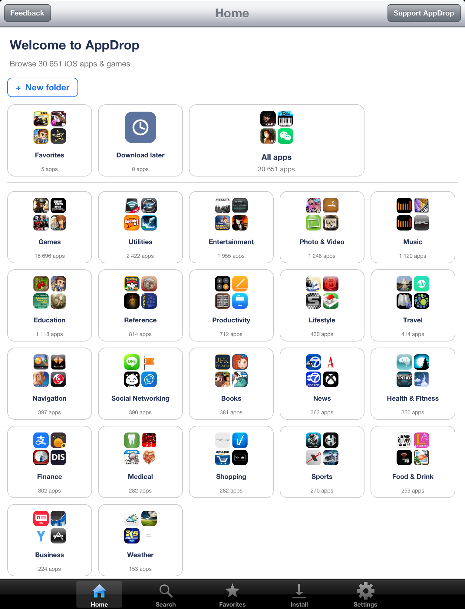
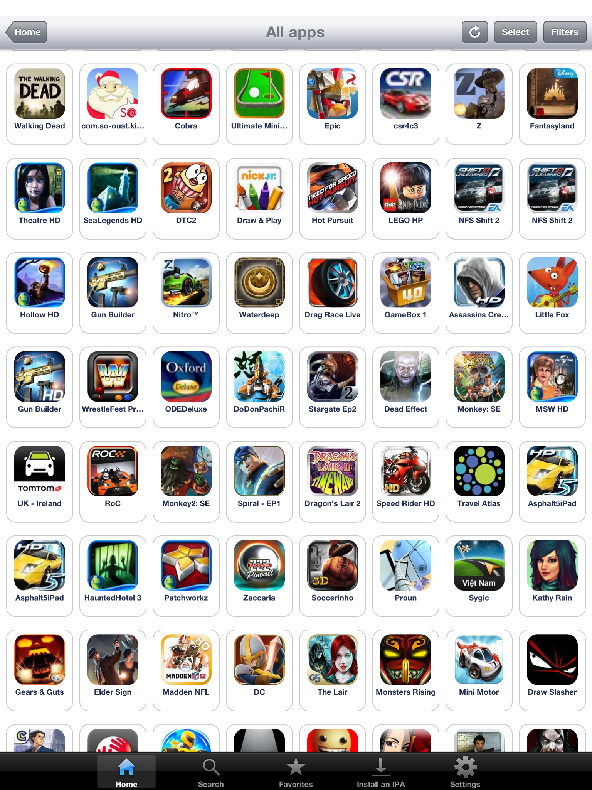
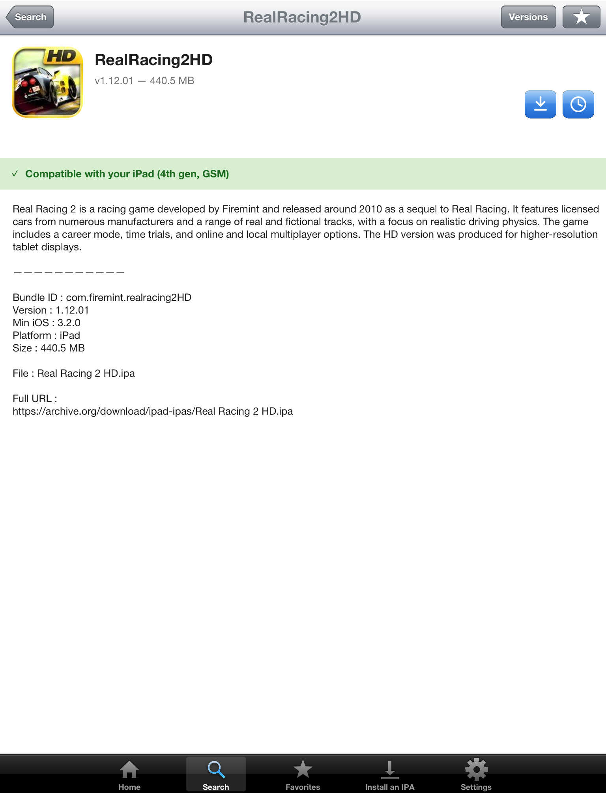
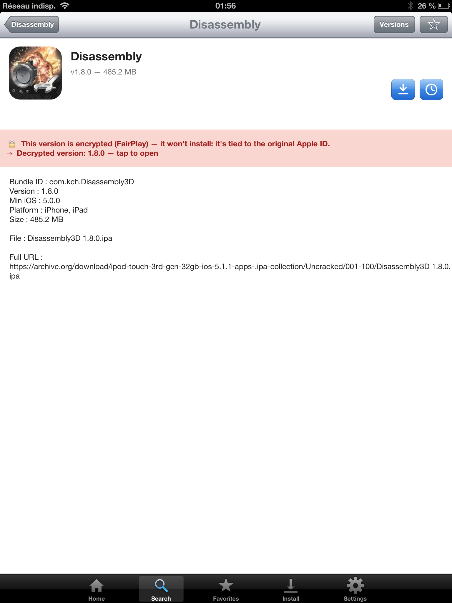
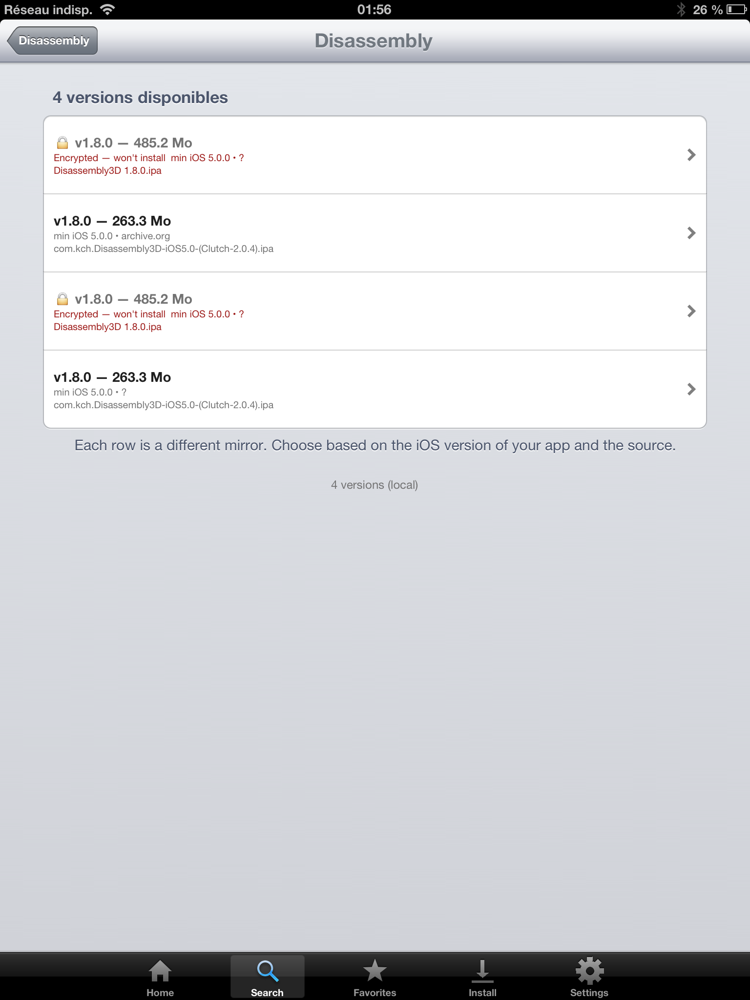
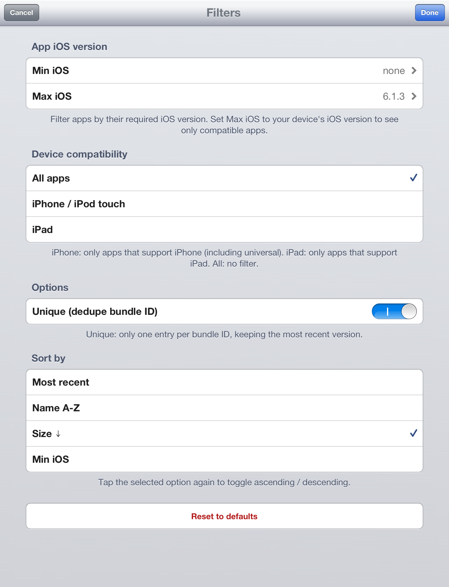
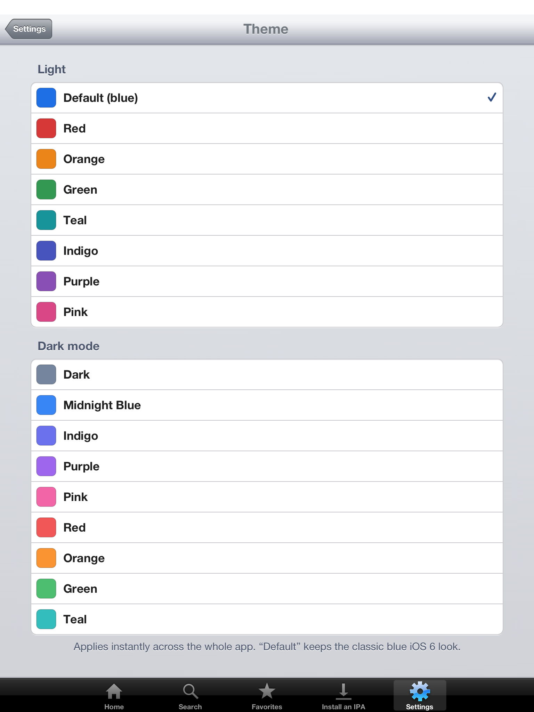
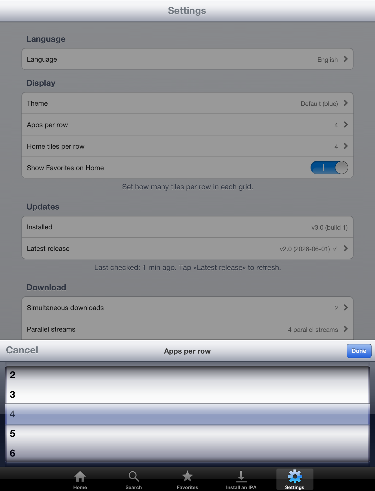
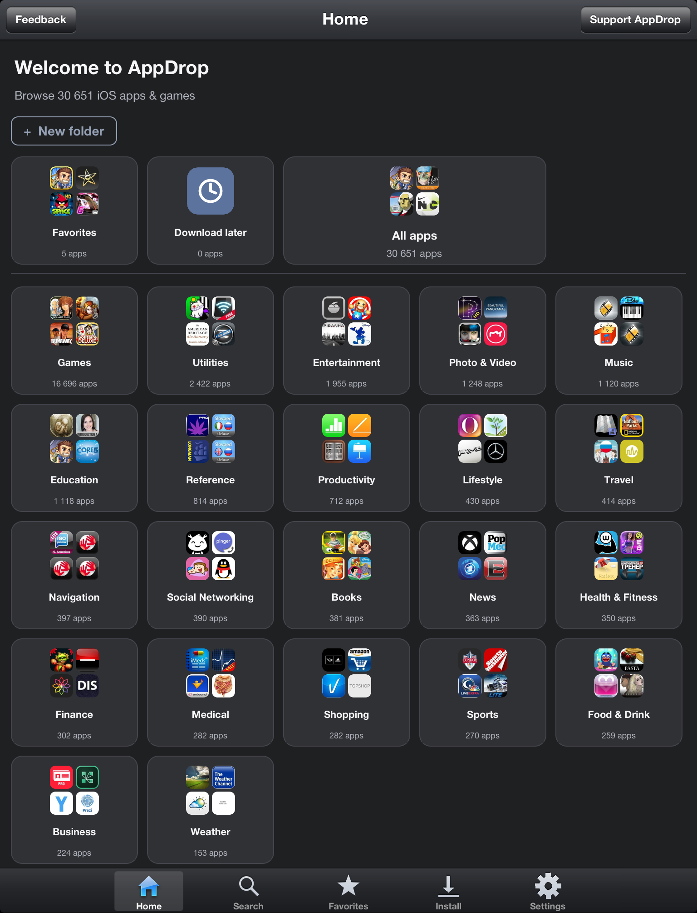
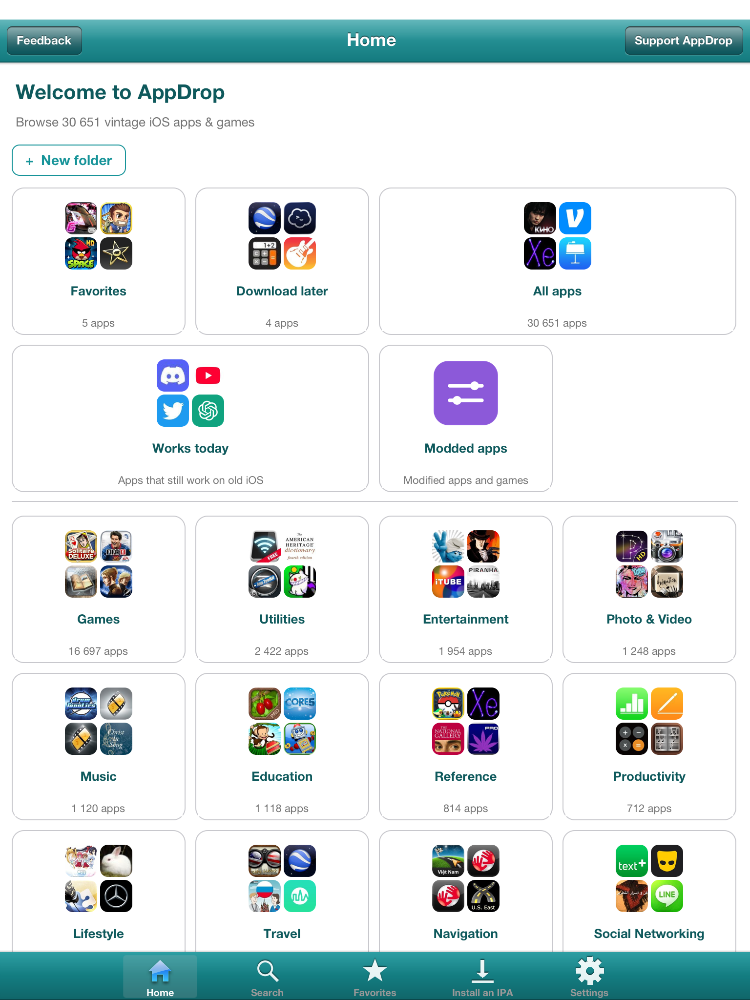

# AppDrop

> Browse 43,000+ iOS apps (2008–2014) — every archived version included — and install them on your jailbroken device.

<p align="center">
  
</p>

<p align="center">
  <a href="https://paypal.me/adrienrl1"><b>💖 Like AppDrop? Tip the dev on PayPal</b></a>
</p>

<p align="center">
  
</p>

<p align="center">
  <b> Runs natively on iPhone, iPod touch & iPad</b> — a clean list or grid on iPhone/iPod, and on iPad a <b>true iPad interface</b> (multi-column grids, large tiles, landscape), not a blown-up phone layout.
</p>

---

## Compatibility

- **iOS 5.0 – 10.x** (armv7 / 32-bit) — fully supported and tested on iPad 1 (iOS 5.1.1), iPhone 5 (iOS 6.1.4), iPad 4 (iOS 6.1.3), iPad mini 2 (iOS 10.3.3).
- **iOS 11+** — not supported. The binary is 32-bit only and Apple dropped 32-bit app support in iOS 11.
- Compatible devices: iPad 1, iPhone 3GS / 4 / 4S, iPad 2 / 3 / 4 / iPad mini, iPod touch 3 / 4 / 5 (and 64-bit devices like iPad Air / iPhone 5S running iOS 10.3.3 or lower).
- Requires a **jailbreak** — that's it. Cydia handles the rest.

## Features

- **43,000+ apps** — browsable **by category** right from the home screen, with every archived version of each app available
- **Native on iPhone, iPod touch & iPad** — a clean list or grid on the phone / iPod, and a true multi-column iPad interface (large tiles, landscape) on iPad — never a stretched-up phone app
- **Auto-updating catalog** — downloaded on first launch and refreshed automatically when new apps are added, so you never reinstall the app just for new content
- **17 themes + full dark mode** — recolour the whole app instantly: 8 light colours and 9 dark variants, applied live with no restart
- **Your own layout** — switch any grid between **list and icons** and pick how many apps/tiles per row with a native iOS-6 wheel
- **Widget-style home** — press and hold any tile until it jiggles, then drag to reorder and drag a tile's bottom-right corner to resize it (1×1 / 2×1 / 2×2); pin your favourites on top, tap Done when you're happy, or hit Reset to start over
- **Favorites & folders** — ⭐ star any app, and organise apps into your own named collections right on the home screen
- **Download later** — queue apps to a "later" list and grab them when you're ready
- **Device-aware** — each app shows whether it'll run on *your* device, the catalog hides apps your iOS can't run, and AppDrop auto-picks the newest version you can actually install
- **FairPlay-aware** — detects DRM-encrypted builds before installing and steers you to a clean, installable version
- **9 languages** — EN / FR / ES / DE / PT‑BR / JA / ZH‑Hans / TR / PL, auto-detected from your device
- **Localized app descriptions** — rich descriptions for thousands of apps, in all 9 languages
- **Multi-select install** — queue up dozens of apps in one batch, with a configurable max of simultaneous downloads (1–8)
- **Pause, resume & cancel** — pause a running download and pick it back up later, with live progress and a "N downloading · M waiting" counter
- **DNS-over-HTTPS + HTTP proxy** — installs keep working even where your ISP blocks archive.org at the DNS level, and downloads honour your manual Wi-Fi HTTP proxy if you set one
- **Skeuomorphic iOS 6 UI** — fits naturally into your jailbroken device
- **No backend, no account, no tracking** — talks directly to archive.org

## Install

> AppDrop is distributed via Cydia. No manual IPA transfer, no SSH, no file manager — Cydia handles everything, including the two required dependencies (AppSync Unified, IPA Installer Console).

### Add the AppDrop source

1. Open **Cydia** on your jailbroken device
2. Go to **Sources → Edit → Add**
3. Enter this URL:
   ```
   https://adrienrl1.github.io/cydia/
   ```
4. Tap **Add Source** — Cydia refreshes the source list. The repo is named **AdrienRL**.

> **On the oldest devices (mainly iOS 5), Cydia may reject the HTTPS source** with a *"could not be verified"* / TLS error. These devices are missing the modern **Let's Encrypt root certificate (ISRG Root X1)** that `github.io` now chains to. Install it once and the source works:
>
> 1. On the device, open **`http://repo.invoxiplaygames.uk/certificates/`** in Safari — use **`http://`**, *not* `https://`, because the device can't yet verify the very certificate it's about to install (same chicken-and-egg that's blocking Cydia).
> 2. Tap **ISRG Root X1 CA (Let's Encrypt)** and install the certificate (if it doesn't open on its own, go to **Settings → General → Profiles** and install it there).
> 3. Return to Cydia and add `https://adrienrl1.github.io/cydia/` again — it now validates.
>
> iOS 6 and newer already trust this root (verified on iOS 6.1.3 / 6.1.4), so this is only needed on the earliest devices. Certificate page courtesy of [InvoxiPlayGames](https://repo.invoxiplaygames.uk/).

### Install AppDrop

5. From the AdrienRL source, tap **AppDrop**
6. Tap **Install** → **Confirm**

Cydia automatically pulls and installs the two prerequisite packages if you don't have them already:
- **AppSync Unified** by Karen — lets the system load unsigned IPAs
- **IPA Installer Console** by autopear — the actual install tool AppDrop drives under the hood

When the install finishes, AppDrop appears on your home screen. Tap it and you're done.

### Updates

AppDrop's in-app updater checks GitHub Releases hourly and, when a new version is out, opens Cydia directly on the package page so you can tap **Upgrade** in one tap.

### Troubleshooting

| Symptom | Fix |
|---|---|
| Cydia rejects the **HTTPS source** ("could not be verified") on old iOS | Mostly **iOS 5**. Install the **ISRG Root X1 (Let's Encrypt)** root certificate from `http://repo.invoxiplaygames.uk/certificates/` (see the note above the install steps), then add the source again. |
| Cydia can't resolve **AppSync Unified** | Add Karen's official repo `https://cydia.akemi.ai/` (package `ai.akemi.appsyncunified`), then refresh. Use only the official build. |
| Icon not visible after install | Reboot the device, or via SSH run `uicache -p /Applications/AppDrop.app && killall -9 SpringBoard`. |
| App crashes on launch | Confirm your iOS is **5.0 or newer** (iOS 11+ is **not** supported). |
| Dependencies marked as "broken" | Refresh all your sources, then try Install again. |

## Using AppDrop

### Browse by category


The home screen sorts 43,000+ apps into categories (Games, Utilities, Entertainment…), with quick tiles for **All apps**, **Favorites** and **Download later**. Tap a category to browse it, and rearrange or resize the tiles to make the home yours.

### The catalog



Every version of every app, with icons, names and sizes. Use *Filters* to narrow by iOS version, device or sort order, and *Select* for multi-pick batch installs. Prefer a tidy list or a dense icon grid? Set it in **Settings → Display**.

### App details



Each app shows a localized description, version, size and a green/orange banner telling you whether it runs on *your* device. Install it, save it for ⭐ favorites, queue it for later, or browse **every archived version** from the *Versions* button.

### Safe installs — FairPlay detection

<p>
  
  
</p>

Some archived IPAs are still **FairPlay-encrypted** (tied to the original buyer's Apple ID) and just won't launch on a jailbreak. *Before* you download, AppDrop probes the build over a tiny HTTP range request — no full download — and, if it's encrypted, shows a banner and **points you to a clean, decrypted version** when one exists. The *Versions* list flags each encrypted mirror too, so you never waste a 485 MB download on something that can't install.

### Filters



Narrow the catalog by minimum / maximum iOS version, device class (iPhone, iPad, both), uniqueness (one row per bundle ID), and sort order. Tap a sort row again to flip ascending / descending.

### Make it yours — 17 themes & adjustable layout

<p>
  
  
</p>

Pick from **8 light colours** or **9 dark themes** — the whole app retints instantly, no restart. Then dial in your layout: list vs grid, and how many apps or home tiles per row, via a native iOS-6 picker wheel.

<p>
  
  
</p>

## Contribute apps

Got an old `.ipa` that isn't in AppDrop yet? You can add it yourself — no account, no GitHub, just a browser:

**[upload.appdrop.ca](https://upload.appdrop.ca)**

Drag in one or more `.ipa` files (or a whole folder). Each upload lands in an isolated ingest area, is automatically checked (valid IPA, not encrypted, safety-screened), de-duplicated against the catalog, and queued for review before it joins the shared library that every AppDrop install sees. The site is available in 10 languages with automatic light/dark theming.

## How it works

```
Catalog metadata          : stuffed18.github.io/ipa-archive-updated
   ↓ pre-built SQLite (catalog.db.gz) downloaded on first launch, auto-refreshed
IPA download              : http://archive.org/download/X/Y.ipa
   ↓ archive.org → CDN redirect → mbedTLS-bundled HTTPS
Local install             : /usr/bin/ipainstaller path/to/Y.ipa
   ↓
App on home screen ✓
```

AppDrop downgrades archive.org requests from `https://` to `http://` to bypass Fastly's JA3-fingerprint blocking on old TLS clients. The CDN node then redirects to HTTPS, and the bundled mbedTLS handles the Let's Encrypt handshake on iOS 5-6 where the system TLS stack is too old.

## Build from source

Requires the [Theos](https://theos.dev) cross-compile toolchain on macOS.

```bash
git clone https://github.com/AdrienRL1/AppDrop.git
cd AppDrop
export THEOS=$HOME/theos

# One-time: build mbedTLS for armv7 (or use the prebuilt libs in deps/build/)
cd deps && bash build-mbedtls-ios.sh && cd ..

# Build the .deb and deploy directly to a jailbroken device via SSH
gmake package FINALPACKAGE=1
```

## Architecture

| Layer | Technology |
|---|---|
| UI | Objective-C, UIKit, custom `drawRect:` skeuomorphic widgets |
| Networking | Bundled mbedTLS (TLS 1.2) on raw sockets — iOS 5-6 system TLS can't handshake modern servers |
| Catalog DB | SQLite (system `libsqlite3`) |
| Theming | Live palette engine with notification-based retint |
| Install | `posix_spawn` → `/usr/bin/ipainstaller` |
| i18n | NSBundle `.lproj` × 8 langs |
| Build | Theos (clang armv7) |

## Privacy

AppDrop runs no analytics, has no account system, sends no telemetry. See [PRIVACY.md](PRIVACY.md) for the full list of third-party services contacted at runtime.

## License

[MIT License](LICENSE)

## Credits

- **stuffed18** — public IPA catalog metadata at [github.com/stuffed18/ipa-archive-updated](https://github.com/stuffed18/ipa-archive-updated)
- **archive.org** — hosting the actual IPA files
- **mbedTLS** — Apache-2.0 TLS library that made HTTPS work on iOS 5-6
- **autopear** — `ipainstaller`, the helper AppDrop delegates to
- **Yusubera** (Reddit) — Turkish translation
- **Gerg_** (Reddit) — Polish translation

## Disclaimer

AppDrop is a client for publicly-listed archive.org content. The app downloads files that are already available to anyone with a browser. It does not redistribute or host any IPAs itself. Use responsibly — only install software you own or that is freely redistributable (free, archived, homebrew).
